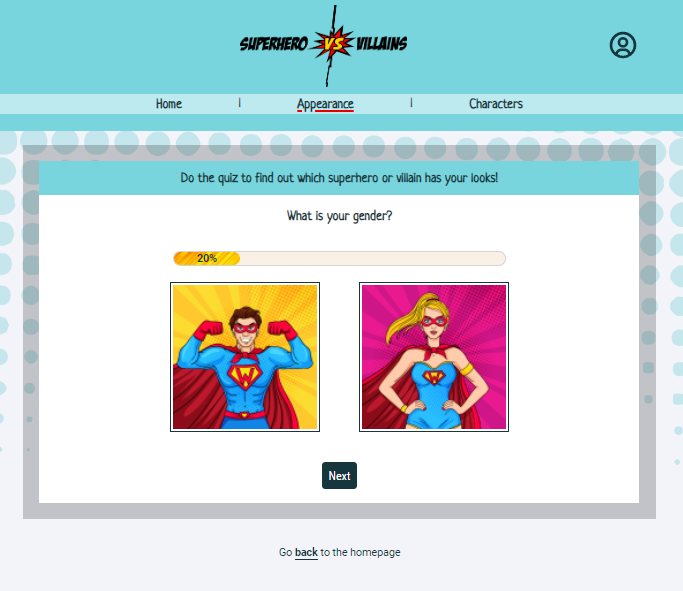

# README Superhero VS Villains

<h4>An application that allows you to answer questions of a quiz to find out which superhero or villain you would be
in the multiverse. But wait... there is more!! The application also allows you to search your favorite character
and views information from more than 500 comic book characters!</h4>

To get access to the quiz you will have to register and login. After you are logged in you will have access to the
quiz, so you can fill it in as many times as you want!

The questions are based on gender, height, hair color, weight and eye color.

## Dependencies

    "axios": "^0.26.1"
    "jwt-decode": "^3.1.2"
    "random-seedable": "^1.0.8"
    "react": "^17.0.2"
    "react-dom": "^17.0.2"
    "react-hook-form": "^7.30.0"
    "react-icons": "^4.3.1"
    "react-router-dom": "^5.2.0"
    "react-scripts": "5.0.0"
    "web-vitals": "^2.1.4"

## API's

For this application i'm making HTTP requests to the Superhero API (https://superheroapi.com/index.html) to fetch the superhero data and process it in
my application. For this application I will use the NOVI backend to register and login the users.

## Installation steps

Install all the dependencies before running the application. You can do this with the command:

### `npm install`

When the dependencies are installed, run the application with the command

### `npm start`

If you receive an error in the console, you first have to add an extension. Install the moesif CORS extension:

https://chrome.google.com/webstore/detail/moesif-origin-cors-change/digfbfaphojjndkpccljibejjbppifbc/related?hl=en-US

 Once installed, click on it in your browser to activate the extension. Make sure the icon’s label goes from
“off”: to “on”: Refresh your application, and the API request should work now! 🎉

## Credits

The application is an addition to the final assignment of the Front-end Bootcamp by NOVI.

####Debby Arends
####08-06-2022